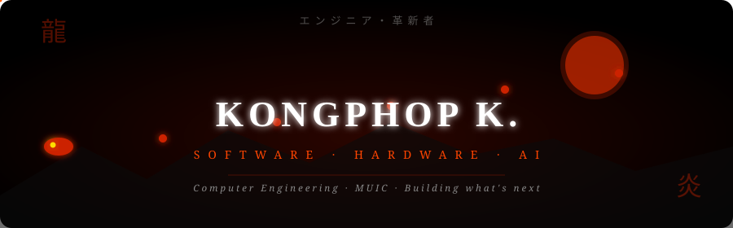
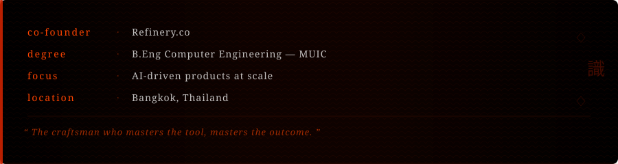

<div align="center">

<!-- ============================================ -->
<!--          ANIMATED DRAGON HERO BANNER         -->
<!-- ============================================ -->


<br/>

<!-- Typing animation subtitle -->
[](https://git.io/typing-svg)

<br/>

[](https://jorvor37.github.io/My_Portfolio/)
[](https://instagram.com/k_kongphopp)
[](https://linkedin.com/in/Jorvor37)
[](mailto:kongphop.kayoonvichien@gmail.com)

</div>

<br/>

<!-- ============================================ -->
<!--                  WHOAMI                      -->
<!-- ============================================ -->



<br/>

<!-- ============================================ -->
<!--              CURRENT QUESTS                  -->
<!-- ============================================ -->
<!--


```diff
+ 🔥  Building AI-powered applications
+ ⚔️  Exploring advanced algorithms and AI models
+ 🐉  Connecting intelligence to everything
```
-->

<br/>

<!-- ============================================ -->
<!--                TECH STACK                    -->
<!-- ============================================ -->


<div align="center">

**LANGUAGES**


**FRAMEWORKS & TOOLS**


[](https://github.com/Jorvor37)
[](https://www.credly.com/badges/00aa69e1-72cb-4f25-a7f0-143f313a07c7/public_url)


</div>

<br/>

<!-- ============================================ -->
<!--             GITHUB SCROLLS                   -->
<!-- ============================================ -->


<div align="center">

<!-- Stats card -->


<!-- Streak -->


<!-- Most used -->


</div>

<br/>

<!-- ============================================ -->
<!--                CLOSING                       -->
<!-- ============================================ -->
<div align="center">

```
　　　龍は眠らない　　　
   The dragon never sleeps.
```

<br/>

[](https://visitcount.itsvg.in)
&nbsp;&nbsp;
[](https://buymeacoffee.com/jorvor37)

</div>
